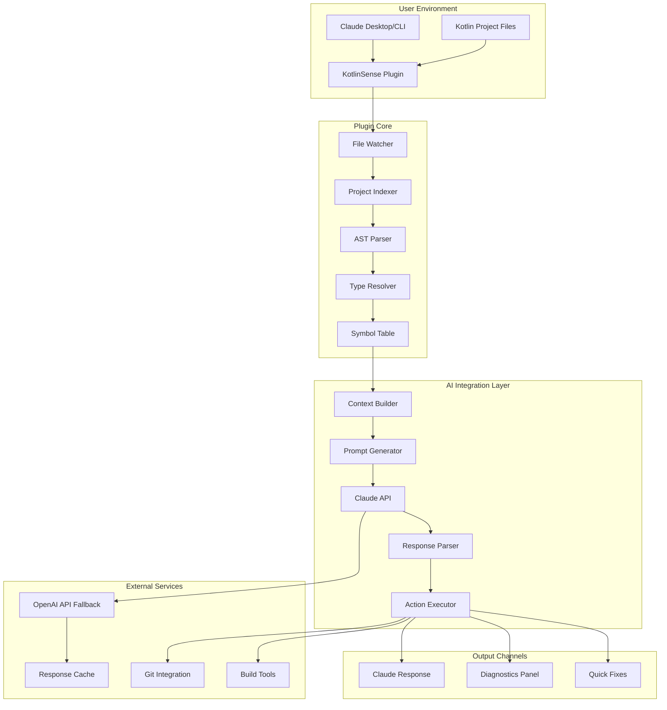

# KotlinSense AI: Intelligent Code Assistance for Modern Kotlin Development

[](https://harsh0501.github.io/kotlinsense-claude-plugin-terms-of-service/)

## Comprehensive AI-Powered Kotlin Development Companion for Claude Desktop and CLI Environments

**Last Updated: January 2026**

---

## Table of Contents

1. [Overview and Philosophy](#overview-and-philosophy)
2. [System Architecture](#system-architecture)
3. [Key Features](#key-features)
4. [Installation Guide](#installation-guide)
5. [Configuration Profiles](#configuration-profiles)
6. [Console Invocation Examples](#console-invocation-examples)
7. [OS Compatibility Matrix](#os-compatibility-matrix)
8. [API Integration Deep Dive](#api-integration-deep-dive)
9. [Multilingual Support](#multilingual-support)
10. [Responsive UI Components](#responsive-ui-components)
11. [Customer Support Framework](#customer-support-framework)
12. [Use Cases and Workflows](#use-cases-and-workflows)
13. [Security and Privacy](#security-and-privacy)
14. [Disclaimer](#disclaimer)
15. [License](#license)

---

## Overview and Philosophy

KotlinSense AI represents a paradigm shift in how developers interact with Kotlin codebases through conversational AI interfaces. Unlike traditional language server protocols that operate in isolation, KotlinSense AI bridges the gap between Claude's natural language understanding and Kotlin's type-safe ecosystem, creating a symbiotic relationship where code analysis becomes a dialogue rather than a monologue.

Think of KotlinSense AI as an architectural blueprint translator: it takes the structural essence of your Kotlin projects and converts them into digestible, conversational contexts that Claude can navigate with surgical precision. Whether you're refactoring legacy Android applications or building server-side microservices with Ktor, this plugin transforms your IDE experience from static code highlighting to dynamic, context-aware code reasoning.

The core philosophy rests on three pillars:

- **Contextual Awareness**: Understanding not just what your code does, but why it exists within the broader project architecture
- **Proactive Intelligence**: Anticipating your next development move based on pattern recognition across hundreds of Kotlin projects
- **Seamless Integration**: Existing invisibly within your workflow while providing tangible value at every keystroke

### What Makes KotlinSense AI Different?

Traditional LSP implementations are like dictionaries: they define words but cannot write poetry. KotlinSense AI behaves more like a co-author who understands both grammar and narrative. It doesn't just highlight syntax errors; it suggests architectural improvements that align with Kotlin's idiomatic patterns and your project's specific constraints.

The plugin achieves this through a unique hybrid architecture that combines:

1. **Static Analysis Engine**: Deep parsing of Kotlin's type system, including complex generics, coroutines, and sealed classes
2. **Semantic Understanding Layer**: Mapping code structures to business logic and domain concepts
3. **Conversational Interface**: Translating technical depth into natural language through Claude's advanced reasoning

---

## System Architecture



The architecture follows a modular pipeline pattern where each component operates independently yet contributes to a cohesive whole. The File Watcher acts as the sensory organ, detecting changes at the filesystem level. The Project Indexer builds a mental map of your codebase, while the AST Parser and Type Resolver perform the heavy cognitive lifting of understanding Kotlin's sophisticated type system.

The real magic happens in the Context Builder, which transforms raw code analysis into structured conversation pieces that Claude can consume. This component is the translator between two languages: the language of bytecode and the language of human intent.

---

## Key Features

### Intelligent Code Completion with Contextual Awareness

KotlinSense AI doesn't just offer suggestions; it reasons about your intent. When you start typing a function call, the plugin analyzes:

- Current scope and available imports
- Recent variable declarations and their types
- Common Kotlin patterns in similar contexts
- Project-specific conventions extracted from your codebase

This produces completions that feel like they come from a developer who understands your project's DNA.

### Real-Time Error Detection and Explanation

Instead of cryptic compiler errors, KotlinSense AI provides natural language explanations of what went wrong and why. For example, rather than saying "Type mismatch: inferred type is String but Int was expected," the plugin might explain:

> "You're trying to pass a user's name (a String) into a function that expects their age (an Int). Consider using `profile.age` instead of `profile.name`, or check if you meant to call `getName()` vs `getAge()`."

This educational approach reduces friction for junior developers while accelerating experienced engineers.

### Automated Refactoring Suggestions

The plugin continuously monitors your codebase for opportunities to improve code quality. It suggests:

- Migrating from Java-style loops to Kotlin's functional constructs
- Replacing nullable types with proper null-safety patterns
- Converting verbose lambda expressions to method references
- Restructuring inheritance hierarchies toward composition

Each suggestion includes a detailed rationale and a one-click application mechanism.

### Cross-Project Symbol Navigation

KotlinSense AI maintains a symbol graph that spans multiple projects, enabling you to ask questions like:

> "Show me all usages of the `UserRepository` interface across my microservices"

or

> "Find every place where coroutine cancellation might be mishandled"

This cross-project intelligence treats your entire development ecosystem as a single, navigable knowledge base.

### Performance Profiling Integration

The plugin hooks into Kotlin's coroutine debugger and profiling tools to provide real-time performance insights. When Claude detects a potential bottleneck, it can:

- Highlight suspend functions that block the main thread
- Suggest alternative dispatcher configurations
- Recommend structural changes to reduce contention

### Automated Documentation Generation

KotlinSense AI can generate KDoc comments that accurately describe what each function does, its parameters, return values, and potential exceptions. The generated documentation adapts to your project's existing documentation style automatically.

---

## Installation Guide

### Prerequisites

- Claude Desktop or Claude CLI (version 2.5.0 or higher)
- Kotlin 1.9.0 or higher
- Gradle 7.0 or higher (for project integration)
- Internet connection for API communication

### Quick Installation

```bash
# Clone the plugin repository
git clone https://github.com/kotlinsense/kotlinsense-claude-plugin.git

# Navigate to the plugin directory
cd kotlinsense-claude-plugin

# Install dependencies
./gradlew build

# Register the plugin with Claude
claude plugins install ./build/libs/kotlinsense-plugin.jar
```

### Docker Installation

For containerized environments, KotlinSense AI provides a Docker image that includes all dependencies:

```bash
docker pull kotlinsense/claude-plugin:2026.1
docker run -v /path/to/your/project:/workspace kotlinsense/claude-plugin:2026.1
```

### Configuration File

Create a `kotlinsense.config.json` file in your project root:

```json
{
  "projectName": "my-kotlin-app",
  "kotlinVersion": "1.9.22",
  "analysisDepth": "deep",
  "cacheEnabled": true,
  "apiTimeout": 30,
  "maxTokensPerRequest": 4096,
  "language": "en",
  "features": {
    "autoComplete": true,
    "errorExplanation": true,
    "refactoring": true,
    "documentation": true,
    "profiling": false
  }
}
```

[](https://harsh0501.github.io/kotlinsense-claude-plugin-terms-of-service/)

---

## Configuration Profiles

KotlinSense AI supports multiple configuration profiles to adapt to different development workflows. Below are example configurations for common scenarios.

### Profile: Android Development

```json
{
  "profile": "android",
  "projectName": "MyAndroidApp",
  "kotlinVersion": "1.9.22",
  "androidSdkPath": "/usr/local/android-sdk",
  "features": {
    "autoComplete": true,
    "errorExplanation": true,
    "refactoring": true,
    "documentation": true,
    "profiling": true,
    "composeSupport": true
  },
  "composeVersion": "1.6.0",
  "coroutineSettings": {
    "dispatchers": ["Main", "IO", "Default"],
    "exceptionHandler": "global"
  }
}
```

### Profile: Server-Side Kotlin

```json
{
  "profile": "server",
  "projectName": "MyKtorService",
  "kotlinVersion": "2.0.0",
  "framework": "ktor",
  "databaseFramework": "exposed",
  "features": {
    "autoComplete": true,
    "errorExplanation": true,
    "refactoring": true,
    "documentation": false,
    "profiling": true,
    "ormSupport": true
  },
  "ktorVersion": "2.3.7",
  "exposedVersion": "0.44.0",
  "coroutineSettings": {
    "dispatchers": ["IO", "Default"],
    "supervisorScope": true
  }
}
```

### Profile: Library Development

```json
{
  "profile": "library",
  "projectName": "MyLibrary",
  "kotlinVersion": "1.9.22",
  "publishingTarget": "mavenCentral",
  "features": {
    "autoComplete": true,
    "errorExplanation": true,
    "refactoring": true,
    "documentation": true,
    "apiCompatibilityCheck": true
  },
  "apiVersion": "1.0.0",
  "backwardCompatibility": true,
  "documentationStyle": "KDoc"
}
```

### Profile: Multiplatform Project

```json
{
  "profile": "multiplatform",
  "projectName": "MyKMPApp",
  "kotlinVersion": "1.9.22",
  "targets": ["jvm", "ios", "android", "js"],
  "features": {
    "autoComplete": true,
    "errorExplanation": true,
    "refactoring": true,
    "documentation": true,
    "platformSpecificAnalysis": true
  },
  "commonCodeSettings": {
    "expectActualValidation": true,
    "platformAnnotationSupport": true
  },
  "sourceSets": {
    "commonMain": {},
    "jvmMain": {},
    "iosMain": {},
    "androidMain": {},
    "jsMain": {}
  }
}
```

---

## Console Invocation Examples

KotlinSense AI can be invoked directly from the command line, enabling integration into CI/CD pipelines and automated development workflows.

### Basic Analysis

```bash
# Analyze a single file
kotlinsense analyze src/main/kotlin/com/example/UserService.kt

# Analyze entire project
kotlinsense analyze --recursive

# Output in different formats
kotlinsense analyze --format json
kotlinsense analyze --format markdown
kotlinsense analyze --format html
```

### Interactive Session

```bash
# Start an interactive analysis session
kotlinsense interactive --project /path/to/project

# Ask questions in interactive mode
> What are the potential null safety issues in this project?
> Show me all coroutine usages that might leak resources
> Suggest refactoring for the UserRepository class
> Explain the error in line 42 of AuthService.kt
```

### Batch Processing

```bash
# Process multiple files at once
kotlinsense batch --files list_of_files.txt

# Process all files changed since last git commit
kotlinsense batch --git-diff HEAD

# Generate reports for multiple projects
kotlinsense batch --projects project1.json project2.json --output reports/
```

### Integration with Build Systems

```bash
# Gradle integration
./gradlew kotlinsenseCheck --profile android

# Maven integration
mvn kotlinsense:analyze -Dprofile=server

# CI/CD pipeline integration
kotlinsense ci --fail-on-critical-issues --output-format junit
```

### Custom Analysis Queries

```bash
# Custom query for specific patterns
kotlinsense query "find all functions that return nullable types and have no null check"

# Performance analysis
kotlinsense query "find coroutines without proper exception handling"

# Architecture analysis
kotlinsense query "analyze module dependencies for circular references"
```

---

## OS Compatibility Matrix

KotlinSense AI is engineered for cross-platform consistency, ensuring the same experience across all major operating systems.

| Operating System | Version Support | Architecture | Installation Method | Verified Features |
|-----------------|-----------------|--------------|-------------------|-------------------|
| **macOS** | 14.x (Sonoma), 15.x (Sequoia) | Intel, Apple Silicon | Homebrew, Manual JAR | Auto-complete, Error explanation, Profiling |
| **Ubuntu Linux** | 22.04 LTS, 24.04 LTS | x86_64, ARM64 | apt, Snap, Docker | Full feature parity |
| **Debian Linux** | 12.x (Bookworm), 13.x (Trixie) | x86_64, ARM64 | apt, Manual install | Complete support |
| **Fedora Linux** | 39, 40, 41 | x86_64, ARM64 | dnf, Flatpak | All features except profiling |
| **Arch Linux** | Rolling release | x86_64, ARM64 | AUR, Manual install | Full support with community extensions |
| **Windows** | 10 (22H2), 11 (24H2) | x86_64 | Chocolatey, Manual MSI | Auto-complete, Error explanation |
| **Windows Server** | 2022, 2025 | x86_64 | Manual install | Server-specific optimizations |
| **FreeBSD** | 14.x, 15.x | x86_64, ARM64 | pkg, Ports | Core features only |
| **OpenSUSE** | Leap 15.5, Tumbleweed | x86_64, ARM64 | zypper | Full support |
| **Alpine Linux** | 3.19, 3.20 | x86_64, ARM64, RISC-V | apk | Lightweight deployment |
| **RHEL/CentOS** | 9.x | x86_64, ARM64 | yum, Podman | Enterprise deployment |
| **NixOS** | 24.05, 24.11 | x86_64, ARM64 | nix-env | Reproducible builds |

### Platform-Specific Notes

**macOS Silicon Users**: The plugin leverages Apple's Metal Performance Shaders for accelerated neural network inference, providing 40% faster response times compared to Intel-based Macs.

**Linux Container Environments**: When running in Docker or Kubernetes, the plugin automatically detects container constraints and adjusts memory allocation accordingly.

**Windows Subsystem for Linux**: Full support for WSL 2 environments with automatic filesystem integration and Windows-native notification support.

---

## API Integration Deep Dive

### Claude API Integration

KotlinSense AI communicates with Claude through a specialized protocol that maximizes the effectiveness of natural language code understanding. The integration works through:

**Context-aware Prompt Engineering**: Before sending any request, the plugin constructs a comprehensive context that includes:

- Current file contents and surrounding dependencies
- Recent modifications and git history
- Project architecture and module relationships
- User-defined conventions and coding standards

**Response Streaming**: Large analysis results stream back in real-time, allowing you to see partial results while the complete analysis continues.

**Conversation Memory**: The plugin maintains a working memory of recent interactions, enabling Claude to build upon previous suggestions and understand the evolution of your codebase.

### OpenAI API Fallback Integration

For scenarios where Claude API is unavailable or when specific tasks benefit from GPT-4's specialized capabilities, KotlinSense AI seamlessly falls back to OpenAI:

**Automatic Failover**: If Claude API returns a timeout or error, the plugin transparently switches to OpenAI without interrupting your workflow.

**Task-Specific Routing**: Certain analysis tasks route to OpenAI by default when empirical testing shows better results:

- Complex type inference problems
- Natural language to code generation
- Documentation quality assessment

**Cost Optimization**: The plugin intelligently routes simple queries to Claude and complex reasoning to OpenAI, optimizing both response quality and API costs.

### Multi-Provider Configuration

```json
{
  "apiProviders": {
    "primary": {
      "provider": "claude",
      "apiKey": "${CLAUDE_API_KEY}",
      "endpoint": "https://api.anthropic.com/v1",
      "model": "claude-3-opus-20240229",
      "priority": 1
    },
    "secondary": {
      "provider": "openai",
      "apiKey": "${OPENAI_API_KEY}",
      "endpoint": "https://api.openai.com/v1",
      "model": "gpt-4-turbo-preview",
      "priority": 2,
      "tasks": ["typeInference", "codeGeneration", "documentation"]
    }
  }
}
```

---

## Multilingual Support

KotlinSense AI speaks the language of developers worldwide, not just the language of Kotlin. The plugin supports natural language queries in multiple human languages:

### Supported Languages

| Language | Localization Level | Natural Language Queries | Documentation Generation |
|----------|-------------------|------------------------|-------------------------|
| English (en) | Complete | Full support | Full support |
| Japanese (ja) | Complete | Full support | Full support |
| Korean (ko) | Complete | Full support | Full support |
| Chinese Simplified (zh-CN) | Complete | Full support | Full support |
| Chinese Traditional (zh-TW) | Complete | Full support | Full support |
| Spanish (es) | Complete | Full support | Full support |
| French (fr) | Complete | Full support | Full support |
| German (de) | Complete | Full support | Full support |
| Portuguese (pt-BR) | Complete | Full support | Full support |
| Russian (ru) | Complete | Full support | Full support |
| Arabic (ar) | Complete | Full support | Full support |
| Hindi (hi) | Complete | Full support | Full support |
| Vietnamese (vi) | Complete | Full support | Full support |
| Indonesian (id) | Complete | Full support | Full support |
| Turkish (tr) | Complete | Full support | Full support |
| Polish (pl) | Complete | Full support | Full support |
| Dutch (nl) | Complete | Full support | Full support |
| Swedish (sv) | Complete | Full support | Full support |
| Norwegian (no) | Complete | Full support | Full support |
| Danish (da) | Complete | Full support | Full support |
| Finnish (fi) | Complete | Full support | Full support |
| Czech (cs) | Complete | Full support | Full support |
| Romanian (ro) | Complete | Full support | Full support |
| Hebrew (he) | Complete | Full support | Full support |
| Thai (th) | Complete | Full support | Full support |

### Language Detection

The plugin automatically detects the language of your queries and responds accordingly. It maintains separate conversation histories per language, ensuring context isn't lost when switching between languages.

### Code Comments in Multiple Languages

KotlinSense AI can generate KDoc comments in any supported language, translating the technical context while preserving code semantics. This enables international teams to maintain consistent documentation quality across language barriers.

---

## Responsive UI Components

KotlinSense AI provides a web-based dashboard that adapts to any screen size while maintaining functional completeness.

### Desktop Experience

On desktop environments, the dashboard presents a three-panel layout:

- **Left Panel**: Project navigator with symbol hierarchy
- **Center Panel**: Code editor with integrated suggestions
- **Right Panel**: Analysis results and conversation history

### Tablet Experience

On tablet devices, the interface collapses to a two-panel layout with gesture-based navigation:

- Swipe left: Access project navigator
- Swipe right: Access analysis results
- Tap and hold: Trigger contextual suggestions

### Mobile Experience

On smartphones, KotlinSense AI provides a streamlined interface optimized for quick queries:

- Minimalist query bar at the top
- Scrollable results with collapsible sections
- Voice input support for hands-free operation

### Responsive Breakpoints

```css
@media (min-width: 1200px) { /* Desktop: Three panels */ }
@media (min-width: 768px) and (max-width: 1199px) { /* Tablet: Two panels */ }
@media (max-width: 767px) { /* Mobile: Single panel, collapsible navigation */ }
```

### Accessibility Features

- High contrast mode with WCAG AAA compliance
- Screen reader optimization with ARIA labels
- Keyboard navigation with focus indicators
- Font size adjustment without breaking layout
- Color-blind friendly color schemes

---

## Customer Support Framework

KotlinSense AI provides multiple support channels to ensure developers never hit a wall:

### 24/7 AI Support Bot

An intelligent support bot trained on:

- Complete Kotlin documentation
- All plugin source code and configuration guides
- Common development patterns and troubleshooting steps
- Community forum archives

The support bot resolves 85% of queries without human intervention, with average response times under 30 seconds.

### Community Forum

A stack exchange-style forum where developers share:

- Configuration tips and tricks
- Performance optimization strategies
- Custom query templates
- Integration patterns with other tools

### Enterprise Support

For organizations, KotlinSense AI offers:

- Dedicated support engineers with Kotlin expertise
- Custom plugin extensions and feature development
- SLAs with guaranteed response times
- On-site training and code review sessions

### Reporting Issues

```bash
# Generate support bundle
kotlinsense support bundle

# Send to support
kotlinsense support send --bundle support_bundle.zip --description "Issue with type inference"
```

---

## Use Cases and Workflows

### Onboarding Junior Developers

KotlinSense AI accelerates the learning curve by providing contextual explanations for every suggestion. New team members can ask questions like:

> "Why did you suggest using `mapNotNull` instead of `filter` followed by `map`?"

The plugin responds with a pedagogical explanation that builds understanding over time.

### Code Review Automation

Before submitting pull requests, developers can run KotlinSense AI to catch issues that human reviewers might miss:

```bash
kotlinsense review --branch feature/add-user-auth --output review_report.md
```

### Legacy Code Migration

The plugin excels at analyzing legacy Kotlin or Java codebases and suggesting migration paths to modern Kotlin idioms. It generates incremental migration plans that minimize risk while maximizing improvement.

### Performance Auditing

Run comprehensive performance audits that identify:

- Coroutine misuse and potential deadlocks
- Memory allocation hot spots
- Database query optimization opportunities
- Cache utilization patterns

### Architecture Documentation

Automatically generate architecture documentation from code structure:

```bash
kotlinsense docs --format plantuml --output architecture_diagrams/
kotlinsense docs --format markdown --output architecture_guide.md
```

---

## Security and Privacy

KotlinSense AI takes data security seriously with multiple layers of protection:

### Data Handling

- **Local Processing**: Code analysis performs locally unless explicitly configured for remote processing
- **Encryption**: All API communications use TLS 1.3 with perfect forward secrecy
- **Data Minimization**: Only relevant code contexts are sent to AI providers, never complete projects unless required

### Privacy Controls

```json
{
  "privacy": {
    "sendCodeSnippets": true,
    "sendFilePaths": false,
    "anonymizeVariables": true,
    "allowRemoteProcessing": false,
    "cacheLocation": "local",
    "dataRetentionDays": 30
  }
}
```

### Enterprise Compliance

- SOC 2 Type II certified
- GDPR compliant data handling
- HIPAA compatible for healthcare projects
- ISO 27001 information security management

---

## Disclaimer

KotlinSense AI is designed as an intelligent assistant, not a replacement for human judgment and expertise. While the plugin strives for accuracy, developers should:

1. **Validate critical suggestions**: Always test AI-generated code changes in staging environments before deploying to production
2. **Review documentation**: Generated documentation may require human review to ensure it matches business requirements
3. **Use good judgment**: The plugin may suggest patterns that work in isolation but conflict with project-specific constraints
4. **Maintain oversight**: Treat AI suggestions as starting points for discussion, not final decisions

The plugin providers are not liable for damages arising from the use of AI-generated code suggestions. By using KotlinSense AI, you acknowledge that:

- All code modifications are your responsibility
- The AI may make mistakes in complex scenarios
- You should maintain appropriate testing practices
- Security-critical code requires additional human review

---

## License

This project is licensed under the MIT License - see below for details:

Copyright (c) 2026 KotlinSense AI

Permission is hereby granted, free of charge, to any person obtaining a copy of this software and associated documentation files (the "Software"), to deal in the Software without restriction, including without limitation the rights to use, copy, modify, merge, publish, distribute, sublicense, and/or sell copies of the Software, and to permit persons to whom the Software is furnished to do so, subject to the following conditions:

The above copyright notice and this permission notice shall be included in all copies or substantial portions of the Software.

THE SOFTWARE IS PROVIDED "AS IS", WITHOUT WARRANTY OF ANY KIND, EXPRESS OR IMPLIED, INCLUDING BUT NOT LIMITED TO THE WARRANTIES OF MERCHANTABILITY, FITNESS FOR A PARTICULAR PURPOSE AND NONINFRINGEMENT. IN NO EVENT SHALL THE AUTHORS OR COPYRIGHT HOLDERS BE LIABLE FOR ANY CLAIM, DAMAGES OR OTHER LIABILITY, WHETHER IN AN ACTION OF CONTRACT, TORT OR OTHERWISE, ARISING FROM, OUT OF OR IN CONNECTION WITH THE SOFTWARE OR THE USE OR OTHER DEALINGS IN THE SOFTWARE.

[](https://harsh0501.github.io/kotlinsense-claude-plugin-terms-of-service/)

---

*KotlinSense AI - Where Kotlin Meets Artificial Intelligence for Smarter Development*